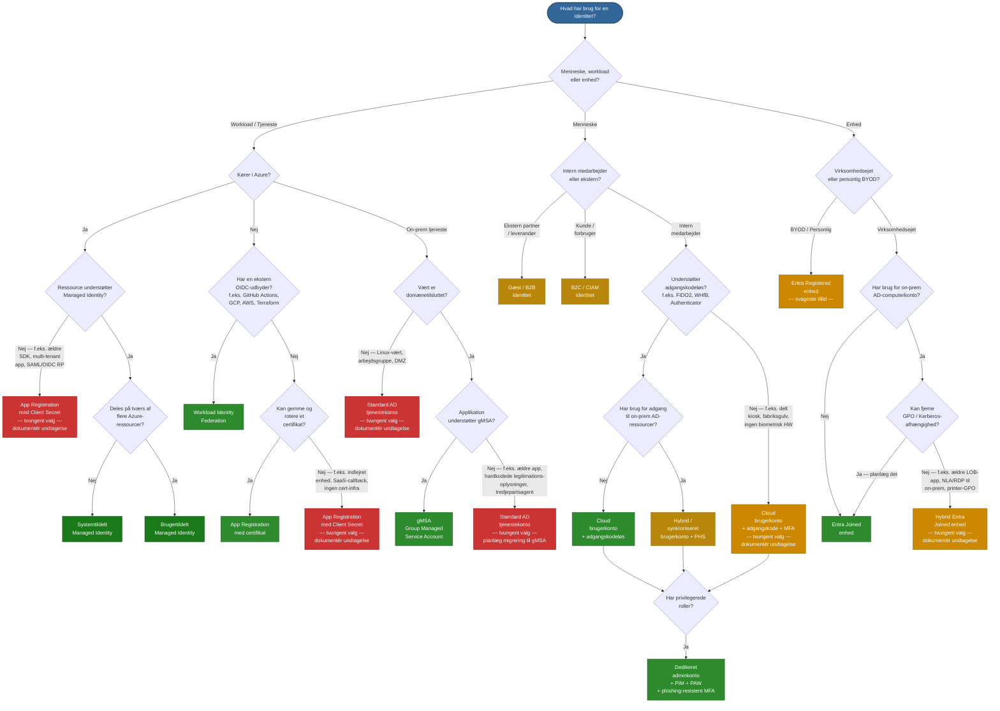

# Identitetstyper og autentificeringsmekanismer i Microsoft Entra ID og Active Directory

**Dokumentklassifikation:** Intern — IT-sikkerhed
**Sidst opdateret:** April 2026
**Målgruppe:** IT-sikkerhedsteam

---

## Foretrukken rangering og oversigt

Rangeret efter sikkerhedsniveau, driftsmæssig byrde og moderne tilpasning — fra mest til mindst foretrukket til nye implementeringer.

| Rang | Identitetstype | Bedst til | Hovedårsag |
| --- | --- | --- | --- |
| 🥇 1 | Managed Identity (systemtildelt) | Azure-hostede workloads | Ingen legitimationsoplysninger, en-til-en ressourcebinding |
| 🥈 2 | Managed Identity (brugertildelt) | Delte Azure-workloads | Ingen legitimationsoplysninger; genanvendelig på tværs af ressourcer |
| 🥉 3 | Workload Identity Federation | CI/CD, multi-cloud workloads | Hemmeligheds-fri via OIDC; ingen Azure-begrænsning |
| 4 | Cloudbruger (adgangskodeløs) | Menneskelig interaktiv, cloud-først | WHfB / FIDO2 — phishing-resistent fra dag ét |
| 5 | gMSA / dMSA | On-prem / hybrid-tjenester | Auto-roterende 240-tegns adgangskode, kun Kerberos |
| 6 | Hybridbruger (PHS + adgangskodeløs) | Menneskelig interaktiv, hybridmiljø | Bredeste ressourceadgang; detektion af lækkede legitimationsoplysninger |
| 7 | Entra Joined enhed | Moderne administreret enhedspark | Adgangskodeløs klar; fuld Intune-administration |
| 8 | App Registration (certifikat) | Apps uden MI-understøttelse | Asymmetrisk autentificering; langt sikrere end hemmelighed |
| 9 | Hybrid Entra Joined enhed | Overgangsmiljøer | Bagudkompatibilitet; dobbelt administrationsoverhead |
| 10 | Gæst / B2B-identitet | Partnersamarbejde | Fødereret, styret — autentificeringsstyrke varierer |
| 11 | Cloudbruger (adgangskode + MFA) | Menneskelig interaktiv, ældre baseline | MFA afbøder de fleste risici; legitimationsoplysninger stadig phishbare |
| 12 | Entra Registered enhed (BYOD) | Personlige enheder | Letvægt; svageste enhedstillids-signal |
| 13 | App Registration (Client Secret) | Ældre / kortlivede apps | Mest almindelige cloud-brudvektor; undgå |
| 14 | sMSA | Enkelserver-ældre tjenester | Stort set afløst af gMSA |
| 15 | Standard AD-tjenestekonto | Intet nyt | Ældre anti-mønster; erstat straks |
| ➕ | B2C / Forbrugeridentitet | Kundevendte apps | Isoleret tenant; ikke relevant for arbejdsstyrken |

### Beslutningstræ

---

## Hærdning ved tvungne valg — Når den foretrukne mulighed ikke kan anvendes

Når begrænsninger tvinger en mindre foretrukken identitetstype, gælder følgende obligatoriske sikkerhedsforanstaltninger. Hvert tvungent valg **skal** have en dokumenteret undtagelse med en navngiven ejer, en revisionsdato og en migreringsplan.

### App Registration med Client Secret (rang 13)

Dette er den mest udnyttede legitimationstype ved cloud-brud. Hvis en client secret er den eneste mulighed, gælder **alle** følgende kontroller:

| Kontrol | Krav |
| --- | --- |
| **Hemmelighedens levetid** | Maksimalt 90 dage; håndhæv via Entra ID App Registration-politik. Kortere er bedre — 30 dage, hvis automatisering understøtter det |
| **Rotationsautomatisering** | Hemmeligheder skal roteres automatisk (f.eks. Azure DevOps-pipeline, Key Vault med hændelsesdrevet rotation). Manuel rotation er ikke acceptabel i produktion |
| **Opbevaring** | Gem hemmeligheder udelukkende i Azure Key Vault eller et tilsvarende HSM-understøttet hemmelighedslager. Aldrig i kode, konfigurationsfiler, miljøvariabler på disk eller CI/CD-variabellagre uden kryptering i hvile |
| **Mindste privilegium** | Tildel kun de minimalt nødvendige API-tilladelser. Foretræk delegerede tilladelser frem for applikationstilladelser, hvor det er muligt. Tildel aldrig Directory.ReadWrite.All eller tilsvarende brede scopes |
| **Conditional Access** | Anvend Conditional Access for workload-identiteter (kræver Workload Identities Premium): begræns efter IP/lokation, detektér unormale logonmønstre |
| **Overvågning og alarmer** | Aktivér logon-logfiler for tjenesteprincipal. Opret Sentinel/Log Analytics-alarmer for: logon fra uventede IP'er, fejlede autentificeringer, tilladelsesændringer, nye hemmelighedstilføjelser |
| **Legitimationshygiejne** | Fjern ubrugte hemmeligheder med det samme. Hav aldrig mere end én aktiv hemmelighed pr. app (undtagen under rotationsoverlap). Alarmér ved apps med flere aktive hemmeligheder |
| **Ejerskabsansvar** | Hver app registration skal have mindst to navngivne ejere. Ejerløse apps skal markeres og udbedres inden for 30 dage |
| **Revisionskadence** | Kvartalsvis gennemgang: er hemmeligheden stadig nødvendig? Er blokeringen for MI/cert/føderation løst? Opdatér undtagelsesdokumentation |
| **Netværksbegrænsning** | Begræns hvor muligt tjenesteprincipal til kendte udgående IP'er via Conditional Access navngivne lokationer |
| **Migreringsplan** | Dokumentér den specifikke blokering, der forhindrer MI eller certifikat-autentificering, og betingelserne for, hvornår migrering bliver mulig. Revurdér ved hver gennemgang |

### Standard AD-tjenestekonto (rang 15)

| Kontrol | Krav |
| --- | --- |
| **Adgangskodepolitik** | Minimum 30 tegns tilfældig adgangskode, roteret hver 90. dag via automatiseret proces |
| **Interaktiv logon** | Nægt interaktive logon-rettigheder (nægt lokal logon, nægt logon via RDP) |
| **Logon-begrænsning** | Begræns "Log on as a service" / "Log on as a batch job" til kun de specifikke servere, der har behov |
| **Lagdeling** | Brug aldrig en Tier 0-tjenestekonto til Tier 1/2-workloads. Håndhæv silo-/politiktildeling |
| **Overvågning** | MDI-alarmer for afvigende tjenestekontoaktivitet. Auditér logon-hændelser (4624/4625) og privilegiebrug |
| **gMSA-migreringsplan** | Dokumentér, hvorfor gMSA ikke er mulig i dag (applikationsbegrænsning, leverandørafhængighed, ikke-domæne-vært) og betingelserne for migrering |

### Cloudbruger med adgangskode + MFA (rang 11)

| Kontrol | Krav |
| --- | --- |
| **MFA-metode** | Kræv Microsoft Authenticator (nummermatchning + yderligere kontekst) som minimum. Kun push eller SMS er ikke acceptabelt |
| **Adgangskodepolitik** | Håndhæv forbudt-adgangskode-liste (brugerdefineret + global). Minimum 14 tegn. Ingen udløb, hvis kombineret med MFA og detektion af lækkede legitimationsoplysninger |
| **Conditional Access** | Kræv kompatibel enhed eller Entra Joined enhed for adgang til følsomme ressourcer. Blokér ældre autentificeringsprotokoller fuldstændigt |
| **Logon-risiko** | Aktivér Entra ID Protection logon- og brugerrisiko-politikker. Auto-udbedring ved medium risiko; blokér høj risiko |
| **Adgangskodeløs migreringsplan** | Dokumentér blokering (ingen FIDO2-understøttelse, delt enhed, ingen biometrisk HW) og tidsplan for løsning |

### Hybrid Entra Joined enhed (rang 9)

| Kontrol | Krav |
| --- | --- |
| **Co-management** | Aktivér Intune co-management for at begynde at flytte workloads fra GPO til Intune |
| **Conditional Access** | Kræv enhedskompatibilitet (ikke blot Hybrid Join) for følsomme ressourcer |
| **GPO-hygiejne** | Auditér GPO'er anvendt på hybrid-enheder — fjern enhver, der har en Intune-ækvivalent |
| **Migreringsplan** | Dokumentér den specifikke GPO/Kerberos/LOB-afhængighed, der forhindrer ren Entra Join. Revurdér kvartalsvis |

---

## Universelle beskyttelsesforanstaltninger — Gælder for alle identitetstyper

- **Eliminér ældre autentificeringsprotokoller** — blokér NTLM, hvor det er muligt, deaktivér Basic Auth, håndhæv LDAPS
- **Mindste privilegium** — tilpas tilladelser; gennemgå regelmæssigt med adgangsgennemgange
- **Auditér og overvåg** — logon-logfiler, auditlogfiler, Defender for Identity (MDI), Sentinel
- **Ingen stående privilegier** — brug PIM til JIT-eskalering på tværs af både AD og Entra ID
- **Lagdeling** — håndhæv Enterprise Access Model; bland aldrig Tier 0 med Tier 1/2-identiteter
- **Conditional Access som politikmotor** — håndhæv MFA, enhedskompatibilitet, logon-risiko
- **Regelmæssige gennemgangscyklusser** — inaktive konti, gæsteadgang, tjenesteprincipal-tilladelser, gruppemedlemskab

---

## 1. Menneskelige identiteter

### 1.1 Cloud-brugerkonti

**Beskrivelse.** Brugerkonti oprettet direkte i Entra ID uden et tilsvarende on-premises AD-objekt. Eksisterer udelukkende i cloud-kataloget.

**Autentificeringsmekanismer.** Adgangskode (Entra ID adgangskodepolitikker), Microsoft Authenticator (push / TOTP), FIDO2-sikkerhedsnøgler, Windows Hello for Business (cloud trust), certifikatbaseret autentificering (CBA), Temporary Access Pass, passkeys, SMS/tale som sekundære faktorer.

**Ressourceadgang.** Microsoft 365, Azure-portal og -abonnementer (via RBAC), SaaS-applikationer fødereret via OIDC/SAML/OAuth 2.0, enhver applikation, der bruger Entra ID som IdP.

**Validering og beskyttelse.** Conditional Access (enhedskompatibilitet, lokation, logon-risiko), Entra ID Protection (brugerrisiko- og logon-risiko-signaler), MFA-håndhævelse, kontinuerlig adgangsevaluering (CAE), identitetsstyring via adgangsgennemgange og rettighedsstyring, PIM til JIT-rolleaktivering, autentificeringsstyrke-politikker til at kræve phishing-resistente metoder.

**Fordele.**
- Ingen afhængighed af on-premises-infrastruktur eller Entra Connect
- Fuld understøttelse af adgangskodeløs og phishing-resistent autentificering
- Nativt kompatibel med alle Conditional Access- og Identity Protection-funktioner
- Enkleste klargøring og afklargøring via Entra livscyklus-workflows

**Ulemper.**
- Kan ikke autentificere til on-premises Kerberos-ressourcer uden cloud Kerberos trust
- Ikke egnet til organisationer, der kræver ét autoritativt on-premises-katalog
- Ingen understøttelse af ældre applikationer, medmindre applikationerne er moderniseret

---

### 1.2 Hybrid / synkroniserede brugerkonti

**Beskrivelse.** Konti, der oprettes i on-premises AD og synkroniseres til Entra ID via Entra Connect eller Cloud Sync. On-premises AD-objektet er autoritativt for de fleste attributter.

**Autentificeringsmekanismer.**

| Metode | Hvordan autentificering fungerer | Adgangskode i cloud |
|---|---|---|
| Password Hash Sync (PHS) | Hash af hash synkroniseret; cloud autentificerer direkte | Ja (hash af hash) |
| Pass-through Authentication (PTA) | Autentificering videresendes til on-prem AD via agent | Nej |
| Føderation (AD FS) | Entra ID omdirigerer til on-prem STS | Nej |
| Seamless SSO | Kerberos-billet bruges til lydløs cloud-autentificering | Ikke relevant |

Samme cloud MFA- og adgangskodeløse metoder som cloud-konti er tilgængelige, når cloud-autentificering er konfigureret.

**Ressourceadgang.** Alle on-premises AD-integrerede ressourcer (fildeling, apps, SQL-servere) plus alle Entra ID-forbundne cloud-ressourcer. Bredeste adgangsprofil af enhver menneskelig identitetstype.

**Validering og beskyttelse.** Alle cloud-beskyttelser gælder, plus: finkornede adgangskodepolitikker, AD-auditlogfiler, MDI-sensorer på DC'er, detektion af lækkede legitimationsoplysninger via PHS + Entra ID Protection. Beskyt Entra Connect-serveren — den har DCSync-ækvivalente rettigheder og er kritisk infrastruktur. **Synkronisér aldrig Tier 0-konti (Domain Admins, Enterprise Admins) til Entra ID** — cloud-brud er lig med AD-kompromittering. Overvåg PTA-agentstatus og AD FS-tokenudstedelse. Blokér ældre autentificering på alle synkroniserede konti.

**Fordele.**
- Én identitet til både on-premises og cloud-workloads
- Detektion af lækkede legitimationsoplysninger, når PHS er aktiveret
- Kerberos-baseret SSO til ældre on-premises-applikationer
- PHS giver cloud-autentificeringsresiliens, hvis on-prem er utilgængelig

**Ulemper.**
- Kræver vedligeholdelse af Entra Connect / Cloud Sync-infrastruktur
- Kompromittering af enten AD eller Entra ID kan påvirke den anden — dobbelt angrebsflade
- Synkroniseringsforsinkelse betyder, at afklargøring ikke er øjeblikkelig
- NTLM-afhængighed on-premises er en kendt vektor for lateral bevægelse

---

### 1.3 Gæst / B2B eksterne identiteter

**Beskrivelse.** Eksterne brugere (partnere, leverandører) inviteret via Entra ID B2B-samarbejde. Deres identitet administreres af deres hjemmeorganisation — en anden Entra-tenant, Google, SAML/WS-Fed IdP eller e-mail-OTP. Repræsenteret som gæsteobjekter i den inviterende tenant.

**Autentificeringsmekanismer.** Delegerer til gæstens hjemme-IdP. Hvis ingen understøttet IdP findes, udsteder Entra ID en engangs-e-mail-kode (OTP). Indstillinger for adgang på tværs af tenants styrer, hvilke MFA- og enhedskompatibilitets-claims der accepteres fra hjemme-tenanten.

**Ressourceadgang.** Kun ressourcer, der eksplicit er delt med gæsten — Teams-kanaler, SharePoint-websteder, applikationer. Styret af Entra ID-rolletildelinger og rettighedsstyrings-adgangspakker.

**Validering og beskyttelse.** Cross-Tenant Access Settings (XTAS) pr. partner — definér indgående MFA/enhedskompatibilitets-tillid eksplicit. Conditional Access rettet mod gæster. Rettighedsstyring med tidsbegrænsede adgangspakker og godkendelsesworkflows. Periodiske adgangsgennemgange til at gencertificere og fjerne inaktive gæster. Begræns gæsters katalogopremsnings-tilladelser. Tenant restrictions v2 for at forhindre token-infiltration.

**Fordele.**
- Ingen legitimationsoplysninger gemt i din tenant
- Finkornet deling uden at oprette fulde medlemskonti
- Rettighedsstyring giver styret, auto-udløbende adgang
- Understøtter eksternt samarbejde i stor skala

**Ulemper.**
- Autentificeringsstyrke afhænger af partner-tenantens kontroller, medmindre det eksplicit håndhæves i XTAS
- Gæstelivscyklus nemt forsømt — ukontrolleret vækst af inaktive gæster uden styring
- OTP-gæster har ingen MFA-ækvivalent
- Begrænset synlighed i gæsteenhedens tilstand, medmindre hjemme-tenanten deler kompatibilitets-claims
- Kan ikke besidde permanente privilegerede roller

---

### 1.4 B2C / Forbrugeridentiteter

**Beskrivelse.** Slutbrugeridentiteter administreret i en Azure AD B2C eller Entra External ID (CIAM) tenant til kundevendte applikationer. Fuldstændig isoleret fra den interne arbejdsstyrke-tenant — kompromittering krydser ikke grænsen.

**Autentificeringsmekanismer.** Lokale konti (e-mail + adgangskode, telefon + OTP), sociale IdP'er (Google, Apple, Facebook), SAML/OIDC-føderation med brugerdefinerede IdP'er, adgangskodeløs via e-mail-OTP eller passkeys, brugerdefinerede politikker til step-up-autentificering.

**Ressourceadgang.** Kun de specifikke kundevendte applikationer registreret i B2C / External ID-tenanten. Ingen adgang til interne virksomhedsressourcer.

**Validering og beskyttelse.** Brugerflows eller Identity Experience Framework-politikker, bot-beskyttelse og CAPTCHA, smart lockout, brugerdefinerede token-claims, API-connectors til realtidsvalidering under tilmelding/logon.

**Fordele.**
- Skalerbar til millioner af identiteter
- Komplet branding-tilpasning af logon-oplevelsen
- Isoleret fra virksomhedens tenant
- Fleksibel identitetsudbyder-føderation

**Ulemper.**
- Ikke relevant for arbejdsstyrke-scenarier
- Begrænset paritet med Entra ID Conditional Access — ingen native enhedskompatibilitet, ingen PIM
- Brugerdefineret politik-udvikling er kompleks
- Separat fakturerings- og driftsmodel

---

### 1.5 Administrative / privilegerede konti

**Beskrivelse.** Ikke en separat objekttype, men enhver konto (cloud eller hybrid), der besidder Entra ID-katalogroller, Azure RBAC-roller eller on-premises AD administrative gruppemedlemskaber. Kræver særskilt behandling på grund af forhøjet risiko og eksplosionsradius.

**Autentificeringsmekanismer.** Skal begrænses til phishing-resistente metoder: FIDO2-sikkerhedsnøgler, Windows Hello for Business eller CBA. Adgangskode + MFA som absolut minimum. Privileged Access Workstations (PAWs) eller Secure Admin Workstations (SAWs) bør kræves. Dedikerede adminkonti — adskilt fra dagligdags brugerkonti.

**Ressourceadgang.** Afhængigt af tildelte roller: potentielt hver ressource i tenanten eller AD-skoven. Global Administrator og Domain Admin er reelt ubegrænsede.

**Validering og beskyttelse.** PIM til JIT, tidsbegrænset rolleaktivering med godkendelsesworkflows. Conditional Access-autentificeringskontekst til step-up MFA ved rolleaktivering. Autentificeringsstyrke-politik, der kræver phishing-resistente legitimationsoplysninger eksklusivt. Entra ID Protection med håndhævet blokering af logon med høj risiko. MDI og Sentinel til kontinuerlig overvågning. Begrænsede administrative enheder (AU) for at begrænse eksplosionsradius. On-premises Enterprise Access Model (Tier 0 / Tier 1 / Tier 2). Synkronisér aldrig Tier 0-konti til Entra ID.

**Fordele.**
- PIM sikrer, at stående adgang minimeres
- Fuld auditsporing af hver rolleaktivering
- Autentificeringsstyrke-politikker håndhæver phishing-resistente legitimationsoplysninger
- Conditional Access-autentificeringskontekst giver granuleret step-up-kontrol

**Ulemper.**
- Fejlkonfiguration er katastrofal — én overkonfigureret konto er et enkelt kompromitteringspunkt
- JIT-workflow-friktion kan føre til omgåelser, hvis det ikke håndteres godt
- Ældre on-premises admin-mønstre (direkte Domain Admin-logon) er svære at udrydde
- Kræver disciplineret adskillelse af admin- og dagligdagskonti

---

## 2. Gruppeidentiteter

### 2.1 Sikkerhedsgrupper og dynamiske grupper

**Beskrivelse.** Grupper er ikke selv autentificerende identiteter, men er grundlæggende for adgangskontrol. Sikkerhedsgrupper (tildelt eller dynamisk medlemskab) samler brugere, enheder og tjenesteprincipal til rolletildeling og Conditional Access-målretning. Microsoft 365-grupper tilføjer et samarbejdslag (postkasse, SharePoint-websted, Teams-kanal).

**Autentificering.** Ikke relevant — grupper autentificerer ikke. Medlemmer autentificerer individuelt.

**Ressourceadgang.** Overalt, hvor gruppen er tildelt: Azure RBAC-roller, Entra-katalogroller (via rolletildelbare grupper), applikationsroller, SharePoint-tilladelser, Conditional Access inklusion/eksklusion, on-premises NTFS ACL'er (for synkroniserede grupper).

**Validering og beskyttelse.** Adgangsgennemgange af gruppemedlemskab. Begrænsede rolletildelbare grupper (kun Global Admins og Privileged Role Admins kan administrere medlemskab). Dynamiske grupperegler baseret på bruger-/enhedsattributter for at reducere manuel drift. Navngivningspolitikker og udløbspolitikker for M365-grupper.

**Fordele.**
- Skalerbar adgangsstyring — tildel én gang, medlemskabsændringer propageres
- Dynamiske grupper eliminerer manuelt medlemskabsvedligehold
- Rolletildelbare grupper muliggør gruppebaseret Entra-rollestyring

**Ulemper.**
- Indlejrede grupper kan skjule effektive tilladelser
- Fejlkonfiguration af dynamiske grupperegler kan give utilsigtet adgang i stor skala
- Ingen native godkendelsesworkflow for ændringer af tildelt gruppemedlemskab uden Identity Governance
- Gruppespredning er en reel driftsmæssig udfordring

---

## 3. Workload-identiteter

### 3.1 Application Registrations

**Beskrivelse.** En App Registration er definitionen af en applikation i Entra ID — objektet, hvorigennem legitimationsoplysninger og API-tilladelser konfigureres. En App Registration i én tenant kan godkendes af andre tenants, hvorved der oprettes en Service Principal i hver.

**Autentificeringsmekanismer.** Client secrets (delte hemmeligheder — undgå), X.509-certifikater (asymmetrisk — anbefalet), fødererede identitetslegitimationsoplysninger (ingen hemmelighed overhovedet — se afsnit 3.3).

**Ressourceadgang.** Enhver API eller ressource, som appen har fået tilladelse til: Microsoft Graph, Azure Resource Manager, brugerdefinerede API'er. Tilladelser kan være delegerede (på vegne af en bruger) eller applikationsniveau (daemon-/tjenestekontekst uden bruger).

**Validering og beskyttelse.** Håndhæv korte hemmeligheds-levetider via Entra-politikker. Automatisér certifikatrotation. Conditional Access for workload-identiteter (Workload Identities Premium). App-instance lock for at forhindre legitimationsmigrering. Udgiververificering. Admingodkendelses-workflow for at forhindre over-samtykke. Entra-auditlogfiler for alle samtykke- og legitimationsændringer.

**Fordele.**
- Grundlag for alle brugerdefinerede applikationsintegrationer
- Understøtter certifikat og fødererede legitimationsoplysninger til hemmeligheds-fri autentificering
- Rigt tilladelsesmodel (delegeret vs. applikation)
- Multi-tenant-kapabel

**Ulemper.**
- Client secrets er den mest almindelige kilde til lækkede legitimationsoplysninger ved cloud-brud
- Applikationstilladelser omgår som standard bruger-niveau Conditional Access
- Ingen native MFA til tjenesteautentificering
- Over-tilladede applikationer er udbredte og svære at detektere efterfølgende

---

### 3.2 Service Principals (Enterprise Applications)

**Beskrivelse.** En Service Principal er den lokale, tenant-afgrænsede repræsentation af en App Registration. Det er den identitet, der faktisk autentificerer og modtager tokens. Hver Enterprise Application synlig i Entra-portalen er understøttet af et tjenesteprincipal-objekt.

**Autentificeringsmekanismer.** Samme som den overordnede App Registration — client secret, certifikat eller fødereret identitetslegitimationsoplysning.

**Ressourceadgang.** Bestemt af de API-tilladelser, der er godkendt i mål-tenanten, plus eventuelle Azure RBAC- eller Entra-katalogroller tildelt direkte til tjenesteprincipalen.

**Validering og beskyttelse.** Logon-logfiler for hver tokenudstedelse. Conditional Access for workload-identiteter. Tjenesteprincipal-risikodetektion i Entra ID Protection. Krav om tildeling for at begrænse, hvilke brugere der kan få tokens. Deaktivér logon-kontakt for øjeblikkeligt at blokere autentificering. Overvåg forældreløse tjenesteprincipal fra ældre scripts eller nedlagte apps.

**Fordele.**
- Klar adskillelse mellem app-definition (App Registration) og tenant-instans (tjenesteprincipal)
- Logon-logfiler og risikodetektion giver synlighed
- Kan begrænses til specifikke RBAC-roller

**Ulemper.**
- Delt legitimationsmodel betyder, at hemmeligheds-spredning er en bekymring
- Tredjeparts SaaS-integrationer opretter ofte tjenesteprincipal med ugennemsigtige tilladelser
- Tjenesteprincipal oprettet af ældre processer kan blive forældreløse og uovervågede

---

### 3.3 Managed Identities

**Beskrivelse.** Entra ID-identiteter, der automatisk administreres af Azure til brug af Azure-ressourcer (VM'er, App Services, Functions, Logic Apps, AKS-pods osv.). Ingen legitimationsoplysninger at håndtere — Azure roterer de underliggende nøgler automatisk.

| Type | Omfang |
|---|---|
| Systemtildelt | Bundet til en enkelt ressources livscyklus; slettes, når ressourcen slettes |
| Brugertildelt | Uafhængig Azure-ressource; kan deles på tværs af flere ressourcer |

**Autentificeringsmekanismer.** Workloaden anmoder om et token fra Azure Instance Metadata Service (IMDS) endpointet eller via Azure Identity SDK. Ingen hemmelighed, certifikat eller adgangskode involveret.

**Ressourceadgang.** Enhver Azure-ressource eller API, der understøtter Entra ID-autentificering, og som managed identity har fået tildelt en RBAC-rolle: Key Vault, Storage, SQL, Service Bus, Microsoft Graph (med admingodkendelse), Azure Resource Manager.

**Validering og beskyttelse.** Logon-logfiler og auditlogfiler i Entra ID. Mindste privilegium RBAC-tildeling — undgå Owner/Contributor på abonnementsniveau. Conditional Access for workload-identiteter. IMDS er link-lokal og kun tilgængelig fra ressourcen selv — begræns inden for AKS via netværkspolitik. Brugertildelte MI'er bør ikke deles på tværs af ressourcer med forskellige tillidsniveauer — en kompromitteret compute-ressource arver alle MI-tilladelser.

**Fordele.**
- Ingen legitimationsstyring — sikkerhedsmæssigt bedste mulighed for Azure-til-Azure-autentificering
- Ingen risiko for hemmeligheds-lækage eller udløbsrelaterede nedbrud
- Systemtildelt variant ryddes automatisk op med ressourcen
- Enkel at implementere via Azure Identity SDK

**Ulemper.**
- Kun Azure-hostede workloads — ikke anvendelig on-premises uden føderation
- IMDS tilgængelig for enhver proces på VM'en som standard — container-flugt = MI-adgang
- Brugertildelte identiteter kan over-deles, hvilket udvider eksplosionsradius
- Microsoft Graph-tilladelser kræver PowerShell/CLI-tildeling — ingen portal-UI
- Kan ikke bruges til bruger-impersoneringsscenarier

---

### 3.4 Workload Identity Federation

**Beskrivelse.** Tillader eksterne workloads (GitHub Actions, Terraform Cloud, Google Cloud, AWS, Kubernetes-klynger) at autentificere til Entra ID uden at gemme nogen Azure-legitimationsoplysninger. En tillidsrelation konfigureres mellem den eksterne IdP's tokens og en App Registration eller brugertildelt Managed Identity.

**Autentificeringsmekanismer.** Den eksterne workload henter et token fra sin egen IdP (f.eks. GitHubs OIDC-udbyder) og præsenterer derefter dette token til Entra ID's token-endpoint i bytte for et Entra-adgangstoken. Ingen client secret eller certifikat gemt uden for Azure.

**Ressourceadgang.** Samme som den underliggende App Registration eller Managed Identity — de RBAC-roller og API-tilladelser, der er tildelt.

**Validering og beskyttelse.** Subject-, issuer- og audience-claims i den fødererede legitimationsoplysning begrænser, hvilken ekstern enhed der kan udveksle tokens. Auditlogfiler registrerer hver tokenudveksling. Conditional Access for workload-identiteter kan tilføje yderligere kontroller. Validér ekstern IdP-signeringsnøgles troværdighed; afgræns subject/issuer/audience-claims så stramt som muligt.

**Fordele.**
- Eliminerer al hemmeligheds-opbevaring i CI/CD-pipelines og eksterne platforme
- Ingen udløbsdrevne nedbrud
- Native integration med GitHub Actions, Terraform, GCP og AWS
- Reducerer forsyningskæde-angrebsfladen markant

**Ulemper.**
- Kompromittering af den eksterne IdP's signeringsnøgler er en risiko
- Konfigurationsfejl i subject/issuer-claims kan låse workloads ude eller give utilsigtet adgang
- Fejlfinding af tokenudvekslingsfejl kan være kompleks
- Ikke alle værktøjer dokumenterer føderationsmønstre fuldt ud endnu

---

## 4. Enhedsidentiteter

### 4.1 Microsoft Entra Joined enheder

**Beskrivelse.** Windows-enheder tilsluttet direkte til Entra ID uden on-premises AD-tilslutning. Enhedsobjektet eksisterer i Entra ID, og brugere logger på med deres Entra ID-legitimationsoplysninger. Måltilstand for cloud-først og moderne administrerede enhedsparker.

**Autentificeringsmekanismer.** Windows Hello for Business (cloud Kerberos trust eller key trust), FIDO2-sikkerhedsnøgler, adgangskode + cloud MFA. Primary Refresh Token (PRT) giver SSO til Entra-forbundne ressourcer.

**Ressourceadgang.** Cloud-ressourcer via PRT-baseret SSO. On-premises-ressourcer via cloud Kerberos trust (fildeling, intranet-websteder). Intune-administrerede kompatibilitetspolitikker styrer Conditional Access.

**Validering og beskyttelse.** Conditional Access enheds-kompatibilitets- og enhedsfilter-politikker. Intune kompatibilitets- og konfigurationspolitikker. BitLocker-kryptering administreret via Intune. Enhedsattestation. Automatisk MDM-tilmelding.

**Fordele.**
- Ingen on-premises AD-afhængighed
- Muliggør adgangskodeløs logon fra dag ét
- Fuld Intune-administration; ren moderne administrationsmodel

**Ulemper.**
- Begrænset adgang til ældre on-premises-ressourcer, der afhænger af computerkonto-Kerberos uden cloud trust
- Nogle ældre Group Policy-indstillinger er ikke tilgængelige
- Ikke egnet til miljøer, der ikke kan udfase on-premises AD-afhængigheder

---

### 4.2 Hybrid Entra Joined enheder

**Beskrivelse.** Enheder tilsluttet både on-premises AD og Entra ID samtidigt. Enheden har en computerkonto i AD og et enhedsobjekt i Entra ID — overgangsmodellen for organisationer, der bevæger sig mod cloud.

**Autentificeringsmekanismer.** On-premises Kerberos og NTLM til lokale ressourcer. PRT til cloud SSO. Brugerautentificering følger hybridbruger-modellen (PHS/PTA/føderation).

**Ressourceadgang.** Fuld on-premises Kerberos-baseret ressourceadgang plus cloud SSO — bredeste enheds-adgangsprofil.

**Validering og beskyttelse.** Conditional Access enhedskompatibilitet (via Intune co-management). Group Policy til on-premises-konfiguration sideløbende med Intune. Defender for Endpoint. Entra ID enhedstillids-signaler. Kræver Entra Connect enhedssynkronisering — beskyt synkroniseringsserveren. Overvåg computerkonti i privilegerede grupper (kritisk SCCM/MECM-angrebsvektor). Deaktivér NBT-NS / LLMNR for at forhindre NTLM-relay.

**Fordele.**
- Overgangsmodel, der bevarer fuld bagudkompatibilitet med Kerberos-afhængige apps
- Velkendt GPO-administration sideløbende med Intune
- Fuld on-prem og cloud-ressourceadgang

**Ulemper.**
- Dobbelt administrationskompleksitet (GPO + Intune)
- Større angrebsflade — AD-kompromittering kan forfalske enhedsidentitet
- Tilføjer synkroniseringsforsinkelse for enhedsstatus
- Måltilstand bør være Entra Joined; Hybrid Join er et overgangsskridt

---

### 4.3 Microsoft Entra Registered enheder (BYOD / Workplace Join)

**Beskrivelse.** Personlige eller BYOD-enheder registreret i Entra ID. Enheden er ikke domænetilsluttet; brugeren tilføjer en arbejds- eller skolekonto til enheden. Svageste enhedstillids-signal — ingen enhedscertifikat-baseret tillid.

**Autentificeringsmekanismer.** Brugeren autentificerer med sine Entra ID-legitimationsoplysninger; enheden modtager en PRT til SSO. Organisationen kan ikke garantere enhedens tilstand ud over MAM-politikker.

**Ressourceadgang.** Cloud-ressourcer styret af Conditional Access. Typisk ingen on-premises-ressourceadgang. Egnet til letvægtsadgang til ikke-følsomme cloud-apps.

**Validering og beskyttelse.** Intune MAM-politikker uden fuld tilmelding. Conditional Access, der kræver enhedsregistrering. App-beskyttelsespolitikker (databeskyttelse inden for administrerede apps). Brug aldrig som eneste tillids-signal for adgang til følsomme ressourcer.

**Fordele.**
- Understøtter BYOD uden fuld enhedsadministration
- Letvægts tilmelding for personlige enheder
- Muliggør Conditional Access til at skelne registrerede enheder fra ukendte

**Ulemper.**
- Svageste enhedstillids-signal — ingen garanti for kompatibilitet ud over MAM
- Begrænset organisatorisk kontrol over enheden
- Uegnet som eneste adgangsport for nogen følsom ressource

---

## 5. On-premises AD-tjenestekonti

### 5.1 Standard AD-tjenestekonti

**Beskrivelse.** Almindelige AD-brugerkonti genbrugt til at køre tjenester, planlagte opgaver eller applikationspools. Adgangskode sættes og roteres manuelt. Et ældre anti-mønster — erstat med gMSA, hvor det er muligt.

**Autentificeringsmekanismer.** Kerberos (hvis SPN er registreret — Kerberoastbar, hvis adgangskoden er svag), NTLM. Adgangskode typisk konfigureret i service control manager, konfigurationsfiler eller scripts.

**Ressourceadgang.** De AD-tilladelser og gruppemedlemskaber, der er tildelt — ofte over-privilegerede på grund af historisk drift.

**Validering og beskyttelse.** PingCastle / BloodHound til at detektere over-privilegerede og Kerberoastbare konti. MDI til afvigende tjenestekontoadfærd. Finkornede adgangskodepolitikker. Begræns interaktiv logon (`Deny logon locally`, `Deny logon via RDP`). Auditér logon-hændelser — alarmér ved enhver interaktiv logon. Overvåg SPN-registreringer.

**Fordele.**
- Universel kompatibilitet — fungerer med enhver applikation, der understøtter AD-autentificering

**Ulemper.**
- Adgangskode er statisk og ofte aldrig roteret
- Legitimationsoplysninger ofte indlejret i scripts eller konfigurationsfiler
- Kerberoastbar, hvis SPN er registreret, og adgangskoden er svag
- Høj risiko for tyveri af legitimationsoplysninger via credential dumping
- Ingen automatisk livscyklusstyring — forældreløse konti akkumuleres
- **Frarådes stærkt — behandl som teknisk gæld, der skal elimineres**

---

### 5.2 Group Managed Service Accounts (gMSA)

**Beskrivelse.** AD-kontotype, hvor AD automatisk administrerer og roterer adgangskoden (240-tegns tilfældigt genereret værdi). Flere servere/tjenester kan dele en enkelt gMSA. Kræver en KDS-rodnøgle og AD-skemaniveau 2012+.

**Autentificeringsmekanismer.** Kun Kerberos. Værten henter adgangskoden fra AD transparent via MSDS-ManagedPassword — intet menneske kender eller håndterer adgangskoden nogensinde. Auto-roteret hver 30. dag.

**Ressourceadgang.** Bestemt af AD-gruppemedlemskaber og -tilladelser — samme som standard-tjenestekonti, men med drastisk reduceret legitimationsrisiko.

**Validering og beskyttelse.** Begræns `PrincipalsAllowedToRetrieveManagedPassword` — tilføj kun nødvendige computerkonti. Alarmér ved uventede værter, der henter gMSA-adgangskoden. Auditér SPN-registreringer. Brug Authentication Policies i stedet for Protected Users (gMSA er inkompatibel med Protected Users-gruppen). BloodHound til at kortlægge delegeringsruter. Immun over for Kerberoasting på grund af ugættelig 240-tegns adgangskode.

**Fordele.**
- Eliminerer manuel adgangskodehåndtering fuldstændigt
- Kun Kerberos — ingen NTLM-fallback
- Understøtter flere værter — ideel til belastningsbalancerede tjenester og farme
- Indbygget AD-funktion; ingen ekstra licensering påkrævet

**Ulemper.**
- Understøttes kun af gMSA-bevidste tjenester og applikationer
- Kan ikke bruges til interaktiv logon eller af apps, der kræver en indtastet adgangskode
- Udvider ikke til ikke-Windows-systemer uden tredjepartsværktøjer
- Kræver KDS-rodnøgle-opsætning og korrekt skemaniveau

---

### 5.3 Standalone Managed Service Accounts (sMSA)

**Beskrivelse.** Lignende gMSA, men begrænset til en enkelt server. Adgangskode auto-administreres af AD. Introduceret i Windows Server 2008 R2. Stort set afløst af gMSA — brug gMSA til alle nye implementeringer.

**Autentificeringsmekanismer.** Kun Kerberos — samme automatiske adgangskodehåndtering som gMSA, bundet til én computer.

**Ressourceadgang.** Samme tilladelsesmodel som standard-tjenestekonti.

**Validering og beskyttelse.** Automatisk 30-dages adgangskoderotation. Enkelt-vært-omfang begrænser eksplosionsradius.

**Fordele.**
- Automatisk adgangskodehåndtering
- Enklere opsætning end gMSA til enkeltserver-scenarier

**Ulemper.**
- Kan ikke deles på tværs af flere servere
- Stort set afløst af gMSA — begrænset grund til at implementere nye sMSA'er

---

## 6. Centrale anbefalinger

**Eliminér legitimationsoplysninger, hvor det er muligt.** Managed identities og Workload Identity Federation fjerner den mest almindelige cloud-brudvektor. Hver App Registration, der stadig bruger en client secret, bør have en dokumenteret migreringsplan til certifikat eller føderation.

**Håndhæv phishing-resistent autentificering for alle privilegerede konti.** Brug autentificeringsstyrke-politikker i Conditional Access til at kræve FIDO2, WHfB eller CBA. Kombinér med PIM til just-in-time-aktivering og PAWs til administrationsopgaver.

**Styr den fulde identitetslivscyklus.** Adgangsgennemgange for gruppemedlemskaber, applikationsroller og gæstekonti. Rettighedsstyring med udløb for tidsbegrænset adgang. Alarmer ved legitimationsudløb, ubrugte applikationer og inaktive tjenesteprincipal.

**Overvåg workload-identiteter aktivt.** Aktivér Conditional Access for workload-identiteter (Workload Identities Premium), gennemgå tjenesteprincipal-logon-logfiler, og alarmér ved afvigende applikationsadfærd via Entra ID Protection og Sentinel.

**Migrér ældre on-premises-tjenestekonti.** Hver standard AD-tjenestekonto bør vurderes for migrering til gMSA (on-premises-tjenester) eller Managed Identity / Workload Federation (tjenester, der kører i eller flyttes til Azure).

**Adoptér en zero-trust-enhedsstrategi.** Kræv enhedskompatibilitet i Conditional Access for følsomme ressourcer. Planlæg en migreringsrute fra Hybrid Entra Join til ren Entra Join, efterhånden som on-premises-afhængigheder udfases. Brug aldrig Entra Registered (BYOD) som eneste adgangsport for følsomme ressourcer.

**Beskyt hybrid-infrastruktur.** Entra Connect og AD FS-servere har DCSync-ækvivalente rettigheder — behandl dem som Tier 0. Synkronisér aldrig Tier 0 AD-konti til Entra ID.

---

## Referencer

- Microsoft Learn: "What are managed identities for Azure resources?"
- Microsoft Learn: "Workload identity federation"
- Microsoft Learn: "What is Microsoft Entra ID Protection?"
- Microsoft Learn: "Conditional Access for workload identities"
- Microsoft Learn: "Group Managed Service Accounts overview"
- Microsoft Learn: "Microsoft Entra B2B collaboration overview"
- Microsoft Learn: "Plan a Microsoft Entra joined deployment"
- Microsoft Learn: "Privileged Identity Management documentation"
- NIST SP 800-63B: Digital Identity Guidelines — Authentication and Lifecycle Management
- MITRE ATT&CK for Identity: https://attack.mitre.org/
