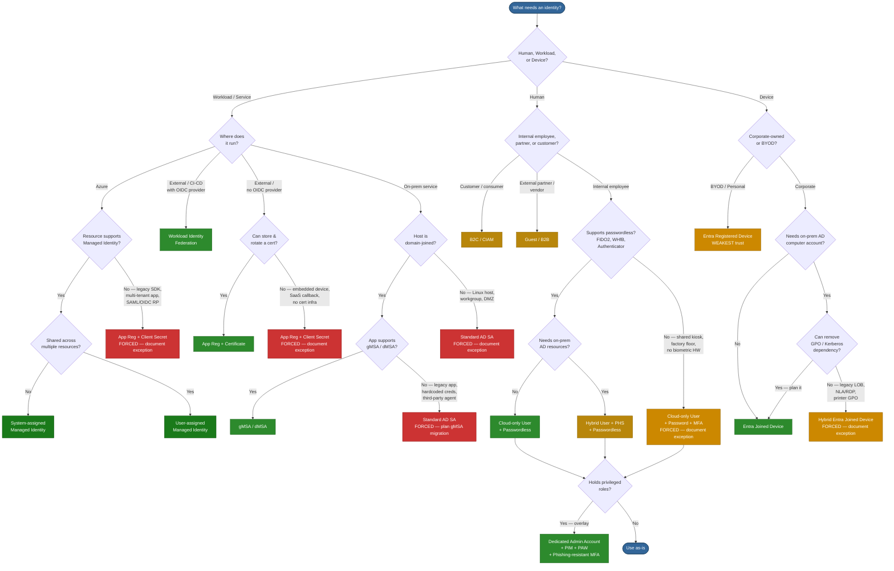

# Identity Types & Authentication Mechanisms in Microsoft Entra ID and Active Directory

**Document Classification:** Internal — IT Security
**Last Updated:** April 2026
**Audience:** IT Security Team

---

## Preferred Ranking & Summary

Ranked by security posture, operational overhead, and modern alignment — most to least preferred for new implementations.

| Rank | Identity Type | Best For | Key Reason |
| --- | --- | --- | --- |
| 🥇 1 | Managed Identity (System-assigned) | Azure-hosted workloads | Zero credentials, one-to-one resource binding |
| 🥈 2 | Managed Identity (User-assigned) | Shared Azure workloads | Zero credentials; reusable across resources |
| 🥉 3 | Workload Identity Federation | CI/CD, multi-cloud workloads | Secretless via OIDC; no Azure-only restriction |
| 4 | Cloud-only User (Passwordless) | Human interactive, cloud-first | WHfB / FIDO2 — phishing-resistant from day one |
| 5 | gMSA / dMSA | On-prem / hybrid services | Auto-rotating 240-char password, Kerberos-only |
| 6 | Hybrid User (PHS + Passwordless) | Human interactive, hybrid env | Broadest resource access; leaked-cred detection |
| 7 | Entra Joined Device | Modern managed estate | Passwordless ready; full Intune management |
| 8 | App Registration (Certificate) | Apps without MI support | Asymmetric auth; far safer than secret |
| 9 | Hybrid Entra Joined Device | Transitional environments | Backward compat; dual management overhead |
| 10 | Guest / B2B Identity | Partner collaboration | Federated, governed — auth strength varies |
| 11 | Cloud-only User (Password + MFA) | Human interactive, legacy baseline | MFA mitigates most risk; credential still phishable |
| 12 | Entra Registered Device (BYOD) | Personal devices | Lightweight; weakest device trust signal |
| 13 | App Registration (Client Secret) | Legacy / short-lived apps | Most common cloud breach vector; avoid |
| 14 | sMSA | Single-server legacy services | Largely superseded by gMSA |
| 15 | Standard AD Service Account | Nothing new | Legacy anti-pattern; replace immediately |
| ➕ | B2C / Consumer Identity | Customer-facing apps | Isolated tenant; not applicable to workforce |

### Decision Tree

---

## Forced-Choice Hardening — When You Cannot Use the Preferred Option

When constraints force a less-preferred identity type, the following mandatory guardrails apply. Every forced choice **must** have a documented exception with a named owner, a review date, and a migration plan.

### App Registration with Client Secret (Rank 13)

This is the single most exploited credential type in cloud breaches. If a client secret is the only option, **all** of the following apply:

| Control | Requirement |
| --- | --- |
| **Secret lifetime** | Maximum 90 days; enforce via Entra ID App Registration policy. Shorter is better — 30 days if automation supports it |
| **Rotation automation** | Secrets must be rotated automatically (e.g. Azure DevOps pipeline, Key Vault with event-driven rotation). Manual rotation is not acceptable for production |
| **Storage** | Store secrets exclusively in Azure Key Vault or an equivalent HSM-backed secret store. Never in code, config files, environment variables on disk, or CI/CD variable stores without encryption at rest |
| **Least privilege** | Grant only the minimum API permissions required. Prefer delegated permissions over application permissions where possible. Never grant Directory.ReadWrite.All or equivalent broad scopes |
| **Conditional Access** | Apply Conditional Access for workload identities (requires Workload Identities Premium): restrict by IP/location, detect anomalous sign-in patterns |
| **Monitoring & alerting** | Enable service principal sign-in logs. Create Sentinel/Log Analytics alerts for: sign-ins from unexpected IPs, failed authentications, permission changes, new secret additions |
| **Credential hygiene** | Remove unused secrets immediately. Never have more than one active secret per app (except during rotation overlap). Alert on apps with multiple active secrets |
| **Owner accountability** | Every app registration must have at least two named owners. Ownerless apps must be flagged and remediated within 30 days |
| **Review cadence** | Quarterly review: is the secret still necessary? Has the blocker to MI/cert/federation been resolved? Update exception documentation |
| **Network restriction** | Where possible, restrict the service principal to known egress IPs using Conditional Access named locations |
| **Migration plan** | Document the specific blocker preventing MI or certificate auth, and the conditions under which migration becomes possible. Re-evaluate at each review |

### Standard AD Service Account (Rank 15)

| Control | Requirement |
| --- | --- |
| **Password policy** | Minimum 30-character random password, rotated every 90 days via automated process |
| **Interactive logon** | Deny interactive logon rights (deny log on locally, deny log on through RDP) |
| **Logon restriction** | Restrict "Log on as a service" / "Log on as a batch job" to only the specific servers that need it |
| **Tiering** | Never use a Tier 0 service account for Tier 1/2 workloads. Enforce silo/policy assignment |
| **Monitoring** | MDI alerts for service account anomalies. Audit logon events (4624/4625) and privilege use |
| **gMSA / dMSA migration plan** | Document why neither gMSA nor dMSA is possible today (app limitation, vendor dependency, non-domain host, sub-Server-2025 DCs) and the conditions for migration |

### Cloud-Only User with Password + MFA (Rank 11)

| Control | Requirement |
| --- | --- |
| **MFA method** | Require Microsoft Authenticator (number matching + additional context) at minimum. Push-only or SMS is not acceptable |
| **Password policy** | Enforce banned-password list (custom + global). Minimum 14 characters. No expiry if combined with MFA and leaked-credential detection |
| **Conditional Access** | Require compliant device or Entra Joined device for sensitive resource access. Block legacy authentication protocols entirely |
| **Sign-in risk** | Enable Entra ID Protection sign-in and user risk policies. Auto-remediate medium risk; block high risk |
| **Passwordless migration plan** | Document blocker (no FIDO2 support, shared device, no biometric HW) and timeline for resolution |

### Hybrid Entra Joined Device (Rank 9)

| Control | Requirement |
| --- | --- |
| **Co-management** | Enable Intune co-management to begin shifting workloads from GPO to Intune |
| **Conditional Access** | Require device compliance (not just Hybrid Join) for sensitive resources |
| **GPO hygiene** | Audit GPOs applied to hybrid devices — remove any that have an Intune equivalent |
| **Migration plan** | Document the specific GPO/Kerberos/LOB dependency preventing pure Entra Join. Re-evaluate quarterly |

---

## Universal Protections — Apply to All Identity Types

- **Eliminate legacy authentication protocols** — block NTLM where possible, disable Basic Auth, enforce LDAPS
- **Least privilege** — right-size permissions; review regularly with Access Reviews
- **Audit and monitor** — sign-in logs, audit logs, Defender for Identity (MDI), Sentinel
- **No standing privilege** — use PIM for JIT elevation across both AD and Entra ID
- **Tiering** — enforce Enterprise Access Model; never mix Tier 0 with Tier 1/2 identities
- **Conditional Access as policy engine** — enforce MFA, device compliance, sign-in risk
- **Regular review cycles** — stale accounts, guest access, service principal permissions, group membership

---

## 1. Human Identities

### 1.1 Cloud-Only User Accounts

**Description.** User accounts created directly in Entra ID with no corresponding on-premises AD object. Exist entirely in the cloud directory.

**Authentication mechanisms.** Password (Entra ID password policies), Microsoft Authenticator (push / TOTP), FIDO2 security keys, Windows Hello for Business (cloud trust), certificate-based authentication (CBA), Temporary Access Pass, passkeys, SMS/voice as secondary factors.

**Resource access.** Microsoft 365, Azure portal and subscriptions (via RBAC), SaaS applications federated via OIDC/SAML/OAuth 2.0, any application using Entra ID as IdP.

**Validation & protection.** Conditional Access (device compliance, location, sign-in risk), Entra ID Protection (user-risk and sign-in risk signals), MFA enforcement, continuous access evaluation (CAE), identity governance via access reviews and entitlement management, PIM for JIT role activation, authentication strength policies to mandate phishing-resistant methods.

**Pros.**
- No dependency on on-premises infrastructure or Entra Connect
- Full support for passwordless and phishing-resistant authentication
- Natively compatible with all Conditional Access and Identity Protection features
- Simplest to provision and deprovision via Entra lifecycle workflows

**Cons.**
- Cannot authenticate to on-premises Kerberos resources without cloud Kerberos trust
- Not suitable for organisations requiring a single authoritative on-premises directory
- No legacy application support unless applications have been modernised

---

### 1.2 Hybrid / Synchronised User Accounts

**Description.** Accounts that originate in on-premises AD and are synchronised to Entra ID via Entra Connect or Cloud Sync. The on-premises AD object is authoritative for most attributes.

**Authentication mechanisms.**

| Method | How Auth Works | Password in Cloud |
|---|---|---|
| Password Hash Sync (PHS) | Hash of hash synced; cloud authenticates directly | Yes (hash of hash) |
| Pass-through Authentication (PTA) | Auth forwarded to on-prem AD via agent | No |
| Federation (AD FS) | Entra ID redirects to on-prem STS | No |
| Seamless SSO | Kerberos ticket used for silent cloud auth | N/A |

Same cloud MFA and passwordless methods as cloud-only accounts are available once cloud authentication is configured.

**Resource access.** All on-premises AD-integrated resources (file shares, apps, SQL servers) plus all Entra ID-connected cloud resources. Broadest access profile of any human identity type.

**Validation & protection.** All cloud-only protections apply, plus: fine-grained password policies, AD audit logs, MDI sensors on DCs, leaked-credential detection via PHS + Entra ID Protection. Protect Entra Connect server — it holds DCSync-equivalent rights and is critical infrastructure. **Never sync Tier 0 accounts (Domain Admins, Enterprise Admins) to Entra ID** — cloud breach equals AD compromise. Monitor PTA agent health and AD FS token issuance. Block legacy auth on all synced accounts.

**Pros.**
- Single identity for both on-premises and cloud workloads
- Leaked-credential detection when PHS is enabled
- Kerberos-based SSO to legacy on-premises applications
- PHS provides cloud auth resilience if on-prem is unavailable

**Cons.**
- Requires maintaining Entra Connect / Cloud Sync infrastructure
- Compromise of either AD or Entra ID can affect the other — dual attack surface
- Synchronisation latency means deprovisioning is not instantaneous
- NTLM reliance on-premises is a known lateral-movement vector

---

### 1.3 Guest / B2B External Identities

**Description.** External users (partners, vendors) invited via Entra ID B2B collaboration. Their identity is managed by their home organisation — another Entra tenant, Google, SAML/WS-Fed IdP, or email OTP. Represented as Guest objects in the inviting tenant.

**Authentication mechanisms.** Delegates to the guest's home IdP. If no supported IdP exists, Entra ID issues an email one-time passcode (OTP). Cross-tenant access settings control which MFA and device-compliance claims are accepted from the home tenant.

**Resource access.** Only resources explicitly shared with the guest — Teams channels, SharePoint sites, applications. Governed by Entra ID role assignments and entitlement management access packages.

**Validation & protection.** Cross-Tenant Access Settings (XTAS) per partner — define inbound MFA/device-compliance trust explicitly. Conditional Access targeting guests. Entitlement Management with time-bound access packages and approval workflows. Periodic Access Reviews to recertify and remove stale guests. Restrict guest directory enumeration permissions. Tenant restrictions v2 to prevent token infiltration.

**Pros.**
- No credential stored in your tenant
- Fine-grained sharing without creating full member accounts
- Entitlement Management provides governed, auto-expiring access
- Supports external collaboration at scale

**Cons.**
- Auth strength depends on partner tenant's controls unless explicitly enforced in XTAS
- Guest lifecycle easily neglected — stale-guest sprawl without governance
- OTP guests have no MFA equivalent
- Limited visibility into guest device posture unless home tenant shares compliance claims
- Cannot hold permanent privileged roles

---

### 1.4 B2C / Consumer Identities

**Description.** End-user identities managed in an Azure AD B2C or Entra External ID (CIAM) tenant for customer-facing applications. Completely isolated from the internal workforce tenant — compromise does not cross the boundary.

**Authentication mechanisms.** Local accounts (email + password, phone + OTP), social IdPs (Google, Apple, Facebook), SAML/OIDC federation with custom IdPs, passwordless via email OTP or passkeys, custom policies for step-up authentication.

**Resource access.** Only the specific customer-facing applications registered in the B2C / External ID tenant. No access to internal corporate resources.

**Validation & protection.** User flows or Identity Experience Framework policies, bot protection and CAPTCHA, smart lockout, custom token claims, API connectors for real-time validation during sign-up/sign-in.

**Pros.**
- Scalable to millions of identities
- Complete brand customisation of sign-in experience
- Isolated from the corporate tenant
- Flexible identity provider federation

**Cons.**
- Not applicable to workforce scenarios
- Limited parity with Entra ID Conditional Access — no native device compliance, no PIM
- Custom-policy authoring is complex
- Separate billing and operational model

---

### 1.5 Administrative / Privileged Accounts

**Description.** Not a separate object type, but any account (cloud-only or hybrid) holding Entra ID directory roles, Azure RBAC roles, or on-premises AD administrative group memberships. Merits distinct treatment due to elevated risk and blast radius.

**Authentication mechanisms.** Must be restricted to phishing-resistant methods: FIDO2 security keys, Windows Hello for Business, or CBA. Password + MFA as absolute minimum. Privileged Access Workstations (PAWs) or Secure Admin Workstations (SAWs) should be mandated. Dedicated admin accounts — separate from day-to-day user accounts.

**Resource access.** Depending on assigned roles: potentially every resource in the tenant or AD forest. Global Administrator and Domain Admin are effectively unrestricted.

**Validation & protection.** PIM for JIT, time-bound role activation with approval workflows. Conditional Access authentication context for step-up MFA at role activation. Authentication strength policy requiring phishing-resistant credentials exclusively. Entra ID Protection with enforced high-risk sign-in blocking. MDI and Sentinel for continuous monitoring. Restricted administrative units (AU) to limit blast radius. On-premises Enterprise Access Model (Tier 0 / Tier 1 / Tier 2). Never sync Tier 0 accounts to Entra ID.

**Pros.**
- PIM ensures standing access is minimised
- Full audit trail of every role activation
- Authentication strength policies enforce phishing-resistant credentials
- Conditional Access authentication context provides granular step-up control

**Cons.**
- Misconfiguration is catastrophic — a single over-privileged account is a single point of compromise
- JIT workflow friction can lead to workarounds if not managed well
- Legacy on-premises admin patterns (direct Domain Admin logon) are difficult to eradicate
- Requires disciplined separation of admin and daily-use accounts

---

## 2. Group Identities

### 2.1 Security Groups and Dynamic Groups

**Description.** Groups are not authenticating identities themselves but are fundamental to access control. Security groups (assigned or dynamic membership) aggregate users, devices, and service principals for role assignment and Conditional Access targeting. Microsoft 365 Groups add a collaboration layer (mailbox, SharePoint site, Teams channel).

**Authentication.** Not applicable — groups do not authenticate. Members authenticate individually.

**Resource access.** Wherever the group is assigned: Azure RBAC roles, Entra directory roles (via role-assignable groups), application roles, SharePoint permissions, Conditional Access inclusion/exclusion, on-premises NTFS ACLs (for synced groups).

**Validation & protection.** Access reviews on group membership. Restricted role-assignable groups (only Global Admins and Privileged Role Admins can manage membership). Dynamic group rules based on user/device attributes to reduce manual management drift. Naming policies and expiration policies for M365 Groups.

**Pros.**
- Scalable access management — assign once, membership changes propagate
- Dynamic groups eliminate manual membership maintenance
- Role-assignable groups bring group-based Entra role governance

**Cons.**
- Nested groups can obscure effective permissions
- Dynamic group rule misconfiguration can grant unintended access at scale
- No native approval workflow for assigned-group membership changes without Identity Governance
- Group sprawl is a real operational challenge

---

## 3. Workload Identities

### 3.1 Application Registrations

**Description.** An App Registration is the definition of an application in Entra ID — the object through which credentials and API permissions are configured. An App Registration in one tenant can be consented to by other tenants, creating a Service Principal in each.

**Authentication mechanisms.** Client secrets (shared secrets — avoid), X.509 certificates (asymmetric — recommended), federated identity credentials (no secret at all — see section 3.3).

**Resource access.** Any API or resource for which the app has been granted permission: Microsoft Graph, Azure Resource Manager, custom APIs. Permissions can be delegated (on behalf of a user) or application-level (daemon/service context with no user).

**Validation & protection.** Enforce short secret lifetimes via Entra policies. Automate certificate rotation. Conditional Access for workload identities (Workload Identities Premium). App-instance lock to prevent credential migration. Publisher verification. Admin consent workflow to prevent over-consent. Entra audit logs for all consent and credential changes.

**Pros.**
- Foundation for all custom application integrations
- Supports certificate and federated credentials for secret-free authentication
- Rich permission model (delegated vs application)
- Multi-tenant capable

**Cons.**
- Client secrets are the most common source of leaked credentials in cloud breaches
- Application permissions bypass user-level Conditional Access by default
- No native MFA for service authentication
- Over-permissioned applications are widespread and hard to detect retroactively

---

### 3.2 Service Principals (Enterprise Applications)

**Description.** A Service Principal is the local, tenant-scoped representation of an App Registration. It is the identity that actually authenticates and receives tokens. Every Enterprise Application visible in the Entra portal is backed by a service principal object.

**Authentication mechanisms.** Same as the parent App Registration — client secret, certificate, or federated identity credential.

**Resource access.** Determined by the API permissions consented in the target tenant, plus any Azure RBAC or Entra directory roles assigned directly to the service principal.

**Validation & protection.** Sign-in logs for every token issuance. Conditional Access for workload identities. Service principal risk detection in Entra ID Protection. Assignment-required setting to restrict which users can obtain tokens. Disable sign-in toggle to instantly block authentication. Monitor for orphaned service principals from legacy scripts or decommissioned apps.

**Pros.**
- Clear separation between app definition (App Registration) and tenant instance (service principal)
- Sign-in logs and risk detection provide visibility
- Can be scoped to specific RBAC roles

**Cons.**
- Shared credential model means secret sprawl is a concern
- Third-party SaaS integrations often create service principals with opaque permissions
- Service principals created by legacy processes can become orphaned and unmonitored

---

### 3.3 Managed Identities

**Description.** Entra ID identities automatically managed by Azure for use by Azure resources (VMs, App Services, Functions, Logic Apps, AKS pods, etc.). No credentials to handle — Azure rotates the underlying keys automatically.

| Type | Scope |
|---|---|
| System-assigned | Tied to a single resource's lifecycle; deleted when resource is deleted |
| User-assigned | Independent Azure resource; shareable across multiple resources |

**Authentication mechanisms.** The workload requests a token from the Azure Instance Metadata Service (IMDS) endpoint or via the Azure Identity SDK. No secret, certificate, or password involved.

**Resource access.** Any Azure resource or API supporting Entra ID authentication and to which the managed identity has been granted an RBAC role: Key Vault, Storage, SQL, Service Bus, Microsoft Graph (with admin consent), Azure Resource Manager.

**Validation & protection.** Sign-in logs and audit logs in Entra ID. Least-privilege RBAC assignment — avoid Owner/Contributor at subscription scope. Conditional Access for workload identities. IMDS is link-local and accessible only from the resource itself — restrict within AKS via network policy. User-assigned MIs should not be shared across resources of different trust levels — a compromised compute resource inherits all MI permissions.

**Pros.**
- Zero credential management — highest-security option for Azure-to-Azure auth
- No risk of secret leakage or expiry-related outages
- System-assigned variant automatically cleaned up with the resource
- Simple to implement via Azure Identity SDK

**Cons.**
- Azure-hosted workloads only — not applicable to on-premises without federation
- IMDS accessible to any process on the VM by default — container escape = MI access
- User-assigned identities can be over-shared, widening blast radius
- Microsoft Graph permissions require PowerShell/CLI grant — no portal UI
- Cannot be used for user-impersonation scenarios

---

### 3.4 Workload Identity Federation

**Description.** Allows external workloads (GitHub Actions, Terraform Cloud, Google Cloud, AWS, Kubernetes clusters) to authenticate to Entra ID without storing any Azure credentials. A trust relationship is configured between the external IdP's tokens and an App Registration or User-assigned Managed Identity.

**Authentication mechanisms.** The external workload obtains a token from its own IdP (e.g., GitHub's OIDC provider), then presents that token to Entra ID's token endpoint in exchange for an Entra access token. No client secret or certificate stored outside Azure.

**Resource access.** Same as the underlying App Registration or Managed Identity — whatever RBAC roles and API permissions have been assigned.

**Validation & protection.** Subject, issuer, and audience claims in the federated credential restrict which external entity can exchange tokens. Audit logs capture every token exchange. Conditional Access for workload identities can layer additional controls. Validate external IdP signing key trustworthiness; scope subject/issuer/audience claims as tightly as possible.

**Pros.**
- Eliminates all secret storage in CI/CD pipelines and external platforms
- No expiration-driven outages
- Native integration with GitHub Actions, Terraform, GCP, and AWS
- Significantly reduces supply-chain attack surface

**Cons.**
- Compromise of the external IdP's signing keys is a risk
- Configuration errors in subject/issuer claims can lock out workloads or grant unintended access
- Debugging token-exchange failures can be complex
- Not all tooling fully documents federation patterns yet

---

## 4. Device Identities

### 4.1 Microsoft Entra Joined Devices

**Description.** Windows devices joined directly to Entra ID with no on-premises AD join. The device object exists in Entra ID and users sign in with their Entra ID credentials. Target state for cloud-first and modern managed estates.

**Authentication mechanisms.** Windows Hello for Business (cloud Kerberos trust or key trust), FIDO2 security keys, password + cloud MFA. Primary Refresh Token (PRT) provides SSO to Entra-connected resources.

**Resource access.** Cloud resources via PRT-based SSO. On-premises resources via cloud Kerberos trust (file shares, intranet sites). Intune-managed compliance policies gate Conditional Access.

**Validation & protection.** Conditional Access device-compliance and device-filter policies. Intune compliance and configuration policies. BitLocker encryption managed via Intune. Device attestation. Automatic MDM enrollment.

**Pros.**
- No on-premises AD dependency
- Enables passwordless sign-in from day one
- Full Intune management; clean modern management model

**Cons.**
- Limited access to legacy on-premises resources relying on computer-account Kerberos without cloud trust
- Some legacy Group Policy settings unavailable
- Not suitable for environments that cannot retire on-premises AD dependencies

---

### 4.2 Hybrid Entra Joined Devices

**Description.** Devices joined to both on-premises AD and Entra ID simultaneously. The device has a computer account in AD and a device object in Entra ID — the transitional model for organisations moving to cloud.

**Authentication mechanisms.** On-premises Kerberos and NTLM for local resources. PRT for cloud SSO. User authentication follows the hybrid user model (PHS/PTA/federation).

**Resource access.** Full on-premises Kerberos-based resource access plus cloud SSO — broadest device-access profile.

**Validation & protection.** Conditional Access device compliance (via Intune co-management). Group Policy for on-premises configuration alongside Intune. Defender for Endpoint. Entra ID device trust signals. Requires Entra Connect device sync — protect the sync server. Monitor computer accounts in privileged groups (critical SCCM/MECM attack vector). Disable NBT-NS / LLMNR to prevent NTLM relay.

**Pros.**
- Transitional model preserving full backward compatibility with Kerberos-dependent apps
- Familiar GPO management alongside Intune
- Full on-prem and cloud resource access

**Cons.**
- Dual management complexity (GPO + Intune)
- Larger attack surface — AD compromise can forge device identity
- Adds synchronisation latency for device state
- Goal state should be Entra Joined; Hybrid Join is a stepping stone

---

### 4.3 Microsoft Entra Registered Devices (BYOD / Workplace Join)

**Description.** Personal or BYOD devices registered with Entra ID. The device is not domain-joined; the user adds a work or school account to the device. Weakest device trust signal — no device-certificate-based trust.

**Authentication mechanisms.** User authenticates with their Entra ID credentials; the device receives a PRT for SSO. The organisation cannot guarantee device posture beyond MAM policies.

**Resource access.** Cloud resources gated by Conditional Access. Typically no on-premises resource access. Suitable for lightweight access to non-sensitive cloud apps only.

**Validation & protection.** Intune MAM policies without full enrollment. Conditional Access requiring device registration. App protection policies (data-loss prevention within managed apps). Never use as a sole trust signal for access to sensitive resources.

**Pros.**
- Supports BYOD without full device management
- Lightweight enrollment for personal devices
- Enables Conditional Access to distinguish registered devices from unknown ones

**Cons.**
- Weakest device trust signal — no guarantee of compliance beyond MAM
- Limited organisational control over the device
- Unsuitable as a sole access gate for any sensitive resource

---

## 5. On-Premises AD Service Accounts

### 5.1 Standard AD Service Accounts

**Description.** Regular AD user accounts repurposed to run services, scheduled tasks, or application pools. Password is set and rotated manually. A legacy anti-pattern — replace with gMSA wherever possible.

**Authentication mechanisms.** Kerberos (if SPN registered — Kerberoastable if password is weak), NTLM. Password typically configured in service control manager, config files, or scripts.

**Resource access.** Whatever AD permissions and group memberships have been granted — frequently over-privileged due to historical drift.

**Validation & protection.** PingCastle / BloodHound to detect over-privileged and Kerberoastable accounts. MDI for anomalous service-account behaviour. Fine-grained password policies. Restrict interactive logon (`Deny logon locally`, `Deny logon via RDP`). Audit logon events — alert on any interactive logon. Monitor SPN registrations.

**Pros.**
- Universal compatibility — works with any application supporting AD authentication

**Cons.**
- Password is static and often never rotated
- Credentials frequently embedded in scripts or config files
- Kerberoastable if SPN is registered and password is weak
- High risk of credential theft via credential dumping
- No automatic lifecycle management — orphaned accounts accumulate
- **Strongly discouraged — treat as technical debt to be eliminated**

---

### 5.2 Group Managed Service Accounts (gMSA)

**Description.** AD account type where AD automatically manages and rotates the password (240-character randomly generated value). Multiple servers/services can share a single gMSA. Requires a KDS root key and AD schema level 2012+.

**Authentication mechanisms.** Kerberos only. The host retrieves the password from AD transparently via MSDS-ManagedPassword — no human ever knows or handles the password. Auto-rotated every 30 days.

**Resource access.** Determined by AD group memberships and permissions — same as standard service accounts, but with drastically reduced credential risk.

**Validation & protection.** Restrict `PrincipalsAllowedToRetrieveManagedPassword` — only add required computer accounts. Alert on unexpected hosts retrieving the gMSA password. Audit SPN registrations. Use Authentication Policies instead of Protected Users (gMSA incompatible with Protected Users group). BloodHound to map delegation paths. Immune to Kerberoasting due to unguessable 240-char password.

**Pros.**
- Eliminates manual password management entirely
- Kerberos-only — no NTLM fallback
- Supports multiple hosts — ideal for load-balanced services and farms
- Built-in AD feature; no extra licensing required

**Cons.**
- Only supported by gMSA-aware services and applications
- Cannot be used for interactive logon or by apps requiring a typed password
- Does not extend to non-Windows systems without third-party tooling
- Requires KDS root key setup and correct schema level

---

### 5.3 Delegated Managed Service Accounts (dMSA)

**Description.** New AD account type introduced in Windows Server 2025, designed specifically as the migration target for legacy standard service accounts. A dMSA can take over the SPN and Kerberos identity of a standard service account transparently — clients keep working unchanged, but the original account's password is invalidated and the dMSA's credentials are now machine-bound and managed by AD.

**Authentication mechanisms.** Kerberos-only, tied to the host machine account(s) authorised to retrieve the credential. Credentials cannot be extracted via lsass dumping or Mimikatz-style techniques because the working credential is machine-bound. Password is auto-rotated by AD.

**Resource access.** Same as the legacy account it replaces — SPN, group memberships, and ACLs are preserved through migration. The dMSA inherits the legacy account's access surface; tighten permissions during the migration window where possible.

**Validation & protection.** Requires Windows Server 2025 Domain Controllers and the Server 2025 domain functional level. Migration uses `Start-ADServiceAccountMigration`, which links the legacy SA to the dMSA and invalidates the legacy password. Audit Directory Service Changes (event 5136) for unauthorised migration attempts and SAM property updates on service accounts. Use dMSA in preference to a standard service account whenever you need to retire a legacy SA but the application cannot be re-architected to consume gMSA directly.

**Pros.**
- Drop-in replacement for legacy standard service accounts — applications that hardcode credentials require no code change
- Credentials machine-bound — defeats credential theft via lsass / DCSync replay
- Auto-rotated like gMSA; no human ever sees or handles the password
- `Start-ADServiceAccountMigration` provides a controlled cut-over path with rollback

**Cons.**
- Requires Windows Server 2025 DCs and Server 2025 domain functional level — many environments not there yet
- New feature; ecosystem support and operational tooling still maturing
- Migration is one-way once the legacy password is invalidated — test carefully
- Not portable to non-Windows hosts

---

### 5.4 Standalone Managed Service Accounts (sMSA)

**Description.** Similar to gMSA but restricted to a single server. Password is auto-managed by AD. Introduced in Windows Server 2008 R2. Largely superseded by gMSA — use gMSA for all new deployments.

**Authentication mechanisms.** Kerberos only — same automatic password management as gMSA, bound to one computer.

**Resource access.** Same permission model as standard service accounts.

**Validation & protection.** Automatic 30-day password rotation. Single-host scope limits blast radius.

**Pros.**
- Automatic password management
- Simpler setup than gMSA for single-server scenarios

**Cons.**
- Cannot be shared across multiple servers
- Largely superseded by gMSA — limited reason to deploy new sMSAs

---

## 6. Key Recommendations

**Eliminate credentials wherever possible.** Managed identities and workload identity federation remove the most common cloud-breach vector. Every App Registration still using a client secret should have a documented migration plan to certificate or federation.

**Enforce phishing-resistant authentication for all privileged accounts.** Use authentication strength policies in Conditional Access to mandate FIDO2, WHfB, or CBA. Pair with PIM for just-in-time activation and PAWs for admin tasks.

**Govern the full identity lifecycle.** Access reviews for group memberships, application roles, and guest accounts. Entitlement management with expiration for time-bound access. Alerting on credential expiry, unused applications, and stale service principals.

**Monitor workload identities actively.** Enable Conditional Access for workload identities (Workload Identities Premium), review service-principal sign-in logs, and alert on anomalous application behaviour via Entra ID Protection and Sentinel.

**Migrate legacy on-premises service accounts.** Every standard AD service account should be assessed for migration to gMSA (on-premises services) or managed identity / workload federation (services running in or moving to Azure).

**Adopt a zero-trust device strategy.** Require device compliance in Conditional Access for sensitive resources. Plan a migration path from Hybrid Entra Join to pure Entra Join as on-premises dependencies are retired. Never use Entra Registered (BYOD) as a sole access gate for sensitive resources.

**Protect hybrid infrastructure.** Entra Connect and AD FS servers hold DCSync-equivalent rights — treat them as Tier 0. Never synchronise Tier 0 AD accounts to Entra ID.

---

## References

- Microsoft Learn: "What are managed identities for Azure resources?"
- Microsoft Learn: "Workload identity federation"
- Microsoft Learn: "What is Microsoft Entra ID Protection?"
- Microsoft Learn: "Conditional Access for workload identities"
- Microsoft Learn: "Group Managed Service Accounts overview"
- Microsoft Learn: "Microsoft Entra B2B collaboration overview"
- Microsoft Learn: "Plan a Microsoft Entra joined deployment"
- Microsoft Learn: "Privileged Identity Management documentation"
- NIST SP 800-63B: Digital Identity Guidelines — Authentication and Lifecycle Management
- MITRE ATT&CK for Identity: https://attack.mitre.org/