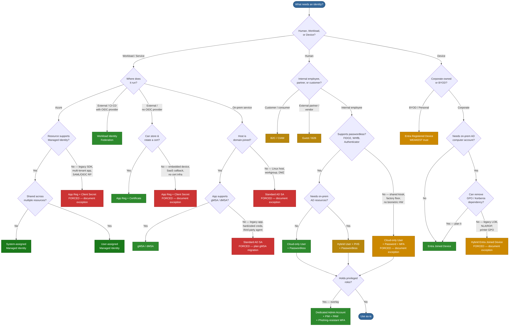

# Identity Types & Authentication — Microsoft Entra ID and Active Directory

Guidance for picking the right identity type and authentication mechanism across Azure, on-premises, and hybrid environments. Ranked by security posture and modern alignment, with mandatory hardening for forced-choice exceptions.

**[Decision tree](#decision-tree)** · **[Documents](#documents)** · **[Key principles](#key-principles)** · **[Build DOCX releases](#building-docx-releases)**

## Decision tree



| Colour | Meaning |
| --- | --- |
| Dark green | Preferred — zero credentials or strongest posture |
| Green | Recommended for the scenario |
| Gold | Acceptable — additional controls required |
| Orange | Transitional — plan migration away |
| Red | Forced choice — document exception, plan migration |

Standalone source: [`identity-decision-tree.md`](identity-decision-tree.md) · [`identity-decision-tree.da.md`](identity-decision-tree.da.md)

## Documents

| Document | Language | Description |
| --- | --- | --- |
| [Entra-AD-Identity-Types-and-Authentication.md](Entra-AD-Identity-Types-and-Authentication.md) | English | Full reference — preferred ranking, decision tree, universal protections, detailed sections per identity type |
| [Entra-AD-Identity-Types-and-Authentication.da.md](Entra-AD-Identity-Types-and-Authentication.da.md) | Dansk | Samme dokument oversat |
| [identity-decision-tree.md](identity-decision-tree.md) | English | Standalone decision tree — flowchart and quick-reference for identity selection |
| [identity-decision-tree.da.md](identity-decision-tree.da.md) | Dansk | Beslutningstræ oversat |

## Key principles

- **Prefer managed/secretless identities** — Managed Identity and Workload Identity Federation eliminate credentials entirely
- **Document exceptions** — when constraints force a less-preferred choice (client secret, standard SA, password + MFA), record why, who owns it, and the migration plan
- **Plan migration** — forced choices are accepted today, not endorsed forever; review quarterly

## Building DOCX releases

```bash
python -m venv .venv
.venv/bin/pip install pypandoc pypandoc_binary
.venv/bin/python build-docx.py
```

Output goes to `release/`. Mermaid diagrams render to PNG via `mmdc` (install with `npm install -g @mermaid-js/mermaid-cli`); without it, the script falls back to a code-block placeholder.

On first run a `reference.docx` template is generated — open in Word to customise styles (fonts, colours, headers), then re-run to apply branding.
