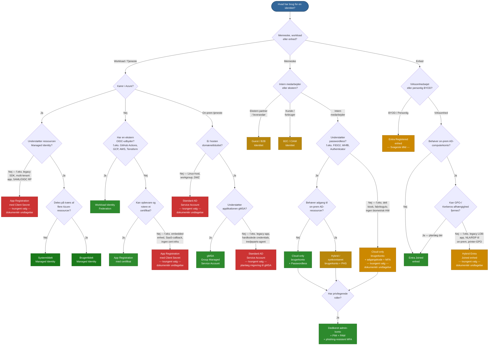

# Beslutningstræ for identitetstyper

## Sådan læses diagrammet

| Farve | Betydning |
| ------ | ------- |
| **Mørkegrøn** | Foretrukken — ingen credentials eller stærkeste sikkerhedsstilling |
| **Grøn** | Anbefalet til scenariet |
| **Guld** | Acceptabel — yderligere kontroller påkrævet |
| **Orange** | Overgangsløsning — planlæg migrering væk |
| **Rød** | Undgå — legacy-antimønster, migrér hurtigst muligt |

## Hurtig reference

| Beslutning | Anbefalet identitet |
| -------- | -------------- |
| Azure-workload, enkelt ressource | Systemtildelt Managed Identity |
| Azure-workload, delt på tværs af ressourcer | Brugertildelt Managed Identity |
| Azure-workload, Managed Identity ikke mulig (multi-tenant, legacy SDK, SAML RP) | App Reg + Client Secret (dokumentér undtagelse) |
| Ikke-Azure-workload, har OIDC-udbyder | Workload Identity Federation |
| Ikke-Azure-workload, kan opbevare certifikat | App Registration + certifikat |
| Ikke-Azure-workload, ingen cert-infra (SaaS, embedded enhed) | App Reg + Client Secret (dokumentér undtagelse) |
| On-prem tjeneste, domænetilsluttet, gMSA-kompatibel | gMSA |
| On-prem tjeneste, app understøtter ikke gMSA (legacy, hardkodede credentials) | Standard AD SA (dokumentér undtagelse, planlæg migrering) |
| On-prem tjeneste, host ikke domænetilsluttet (Linux, DMZ) | Standard AD SA (dokumentér undtagelse) |
| Intern medarbejder, passwordless-kompatibel | Cloud-only bruger + Passwordless |
| Intern medarbejder, ingen passwordless HW (kiosk, fabriksgulv) | Cloud-only bruger + adgangskode + MFA (dokumentér undtagelse) |
| Intern medarbejder, behøver on-prem AD | Synkroniseret bruger + PHS |
| Enhver admin / privilegeret rolle | Dedikeret admin-konto + PIM + PAW |
| Ekstern partner | Guest / B2B |
| Kundevendt applikation | B2C / CIAM |
| Virksomhedsenhed, ingen on-prem-afhængighed | Entra Joined |
| Virksomhedsenhed, kan ikke fjerne GPO/Kerberos (legacy LOB, NLA) | Hybrid Entra Joined (dokumentér undtagelse) |
| Personlig / BYOD-enhed | Entra Registered |

## Hærdning ved tvungne valg

Når beslutningstræet fører til en rød eller orange node, gælder disse obligatoriske sikkerhedsforanstaltninger. Se den fulde vejledning i [Entra-AD-Identity-Types-and-Authentication.md](Entra-AD-Identity-Types-and-Authentication.md#forced-choice-hardening--when-you-cannot-use-the-preferred-option).

| Tvungent valg | Centrale obligatoriske kontroller |
| --- | --- |
| **App Reg + Client Secret** | Maks. 90 dages levetid for secret, automatiseret rotation, kun opbevaring i Key Vault, Conditional Access for workload-identiteter, mindste privilegium, kvartalsvis gennemgang, navngivne ejere, migreringsplan |
| **Standard AD Service Account** | 30+ tegn tilfældig adgangskode, nægt interaktivt logon, begræns logon-as-a-service til specifikke hosts, MDI-overvågning, migreringsplan til gMSA |
| **Cloud-only bruger + adgangskode + MFA** | Authenticator med nummermatch (ingen SMS), 14+ tegn adgangskode, liste over forbudte adgangskoder, kræv kompatibel enhed, login-risikopolitikker, migreringsplan til passwordless |
| **Hybrid Entra Joined enhed** | Aktivér Intune co-management, kræv enhedsoverensstemmelse (ikke kun join), auditér GPO'er for Intune-ækvivalenter, kvartalsvis migreringsgennemgang |
