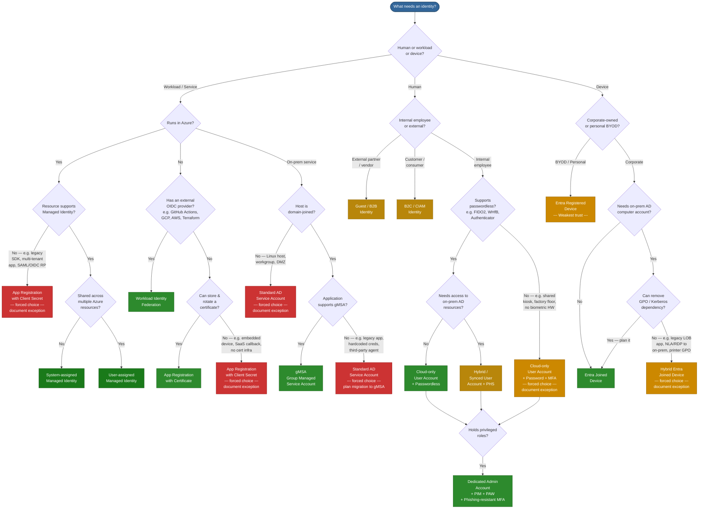

# Identity Type Decision Tree

## How to read this diagram

| Colour | Meaning |
| ------ | ------- |
| **Dark green** | Preferred — zero credentials or strongest posture |
| **Green** | Recommended for the scenario |
| **Gold** | Acceptable — additional controls required |
| **Orange** | Transitional — plan migration away |
| **Red** | Avoid — legacy anti-pattern, migrate ASAP |

## Quick reference

| Decision | Go-to identity |
| -------- | -------------- |
| Azure workload, single resource | System-assigned Managed Identity |
| Azure workload, shared across resources | User-assigned Managed Identity |
| Azure workload, MI not possible (multi-tenant, legacy SDK, SAML RP) | App Reg + Client Secret (document exception) |
| Non-Azure workload, has OIDC provider | Workload Identity Federation |
| Non-Azure workload, can store cert | App Registration + Certificate |
| Non-Azure workload, no cert infra (SaaS, embedded device) | App Reg + Client Secret (document exception) |
| On-prem service, domain-joined, gMSA-capable | gMSA |
| On-prem service, app can't do gMSA (legacy, hardcoded creds) | Standard AD SA (document exception, plan migration) |
| On-prem service, host not domain-joined (Linux, DMZ) | Standard AD SA (document exception) |
| Internal human, passwordless capable | Cloud-only User + Passwordless |
| Internal human, no passwordless HW (kiosk, factory floor) | Cloud-only User + Password + MFA (document exception) |
| Internal human, needs on-prem AD | Synced User + PHS |
| Any admin / privileged role | Dedicated Admin Account + PIM + PAW |
| External partner | Guest / B2B |
| Customer-facing app | B2C / CIAM |
| Corporate device, no on-prem dependency | Entra Joined |
| Corporate device, can't remove GPO/Kerberos (legacy LOB, NLA) | Hybrid Entra Joined (document exception) |
| Personal / BYOD device | Entra Registered |

## Forced-choice hardening

When the decision tree leads to a red or orange node, these mandatory guardrails apply. See the full guidance in [Entra-AD-Identity-Types-and-Authentication.md](Entra-AD-Identity-Types-and-Authentication.md#forced-choice-hardening--when-you-cannot-use-the-preferred-option).

| Forced choice | Key mandatory controls |
| --- | --- |
| **App Reg + Client Secret** | Max 90-day secret lifetime, automated rotation, Key Vault storage only, Conditional Access for workload identities, least-privilege permissions, quarterly review, named owners, migration plan |
| **Standard AD Service Account** | 30+ char random password, deny interactive logon, restrict logon-as-a-service to specific hosts, MDI monitoring, gMSA migration plan |
| **Cloud-only User + Password + MFA** | Authenticator with number matching (no SMS), 14+ char password, banned-password list, require compliant device, sign-in risk policies, passwordless migration plan |
| **Hybrid Entra Joined Device** | Enable Intune co-management, require device compliance (not just join), audit GPOs for Intune equivalents, quarterly migration review |
